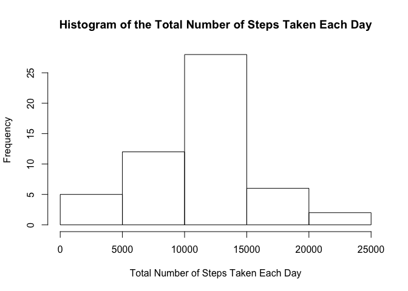
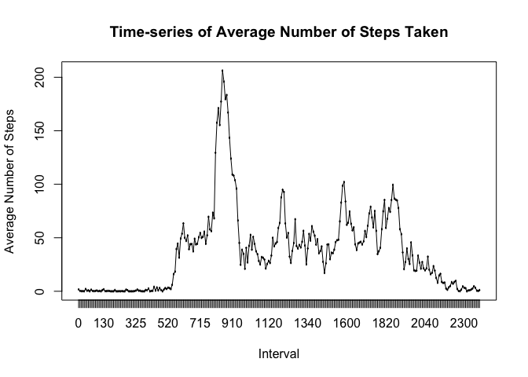
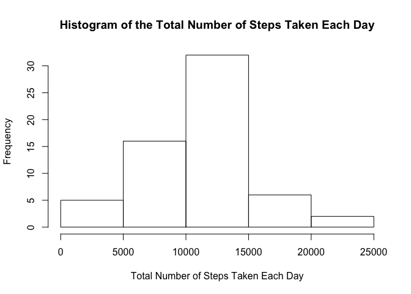
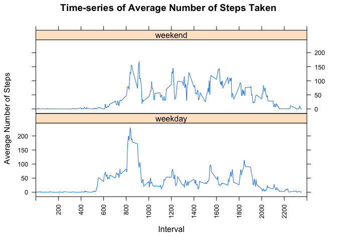

## Loading the Data
Data was loaded using read.csv().

```r
unzip("./activity.zip", exdir = "./activity")
df <- read.csv("./activity/activity.csv")
```

## What is the Mean & Median Total Number of Steps Taken Per Day?

### Histogram
The melt() and dcast() functions in "reshape2"" library were used to compute the **total number of steps taken per day**, before its histogram was plotted.

```r
library(reshape2)
meltedDf <- melt(df)
```

```
## Using date as id variables
```

```r
total <- dcast(meltedDf, date ~ variable , sum)
```

```r
hist(total$steps, main = "Histogram of the Total Number of Steps Taken Each Day", xlab = "Total Number of Steps Taken Each Day")
```

<!-- -->

### Mean & Median Total Number of Steps Taken Per Day
The **mean** total number of steps taken per day was 10,766.2 and the **median** was 10,765.

```r
mean(total$steps, na.rm = TRUE)
```

```
## [1] 10766.19
```

```r
median(total$steps, na.rm = TRUE)
```

```
## [1] 10765
```

## What is the Average Daily Activity Pattern?

### Time-series Plot
The plot below shows the time-series of the average number of steps taken throughout the day. There were more activities in the daytime than at night, with higher number of steps during the morning peak hours.

```r
library(dplyr)
```

```
## 
## Attaching package: 'dplyr'
```

```
## The following objects are masked from 'package:stats':
## 
##     filter, lag
```

```
## The following objects are masked from 'package:base':
## 
##     intersect, setdiff, setequal, union
```

```r
df1 <- select(df, interval, steps)
df1$interval <- as.factor(df1$interval)
meltedDf1 <- melt(df1)
```

```
## Using interval as id variables
```

```r
average <- dcast(meltedDf1, interval ~ variable , mean, na.rm =TRUE)
```

```r
with(average, plot(interval, steps, main = "Time-series of Average Number of Steps Taken",
        xlab = "Interval", ylab = "Average Number of Steps"))
with(average, lines(interval, steps))
```

<!-- -->

### Interval with the Highest Average Number of Steps
The **5-minute interval** that contains the maximum average number of steps is **835**.

```r
average[average$steps == max(average$steps),]
```

```
##     interval    steps
## 104      835 206.1698
```

## Imputing Missing Values

### Total Number of Missing Values in Dataset
There were a total of 2,304 missing values in the dataset.

```r
sum(is.na(df$steps))
```

```
## [1] 2304
```

### Imputation Strategy
The **k-Nearest Neighbours (kNN) approach** was used to impute missing values. kNN imputation identifies "k" closest observations based on euclidean distance and computes the weighted average (weighted based on distance) of these "k" observations (Prabhakaran, 2017). The *DMwR (Data Mining with R) package* was used for the kNN approach to fill in all missing values in the dataset and then stored in the new dataframe "dfimputed".

```r
library(lattice)
library(DMwR)
```

```
## Loading required package: grid
```

```r
set.seed(1234)
dfimputed <- knnImputation(df)
sum(is.na(dfimputed$steps))
```

```
## [1] 0
```

### Histogram After Imputation

```r
meltedDfimputed <- melt(dfimputed)
```

```
## Using date as id variables
```

```r
totalimputed <- dcast(meltedDfimputed, date ~ variable , sum)
hist(totalimputed$steps, main = "Histogram of the Total Number of Steps Taken Each Day", xlab = "Total Number of Steps Taken Each Day")
```

<!-- -->

### Mean & Median Total Number of Steps Taken Per Day After Imputation
The **mean** total number of steps taken per day was 10,637.9 and the **median** was 10,600. After imputating the missing data, the mean and median total number of steps were both reduced by 1.2% and 1.5% respectively.

```r
mean(totalimputed$steps)
```

```
## [1] 10637.85
```

```r
median(totalimputed$steps)
```

```
## [1] 10600
```

```r
(mean(total$steps, na.rm = TRUE) - mean(totalimputed$steps))/ mean(total$steps, na.rm = TRUE) 
```

```
## [1] 0.01192091
```

```r
(median(total$steps, na.rm = TRUE) - median(totalimputed$steps))/ median(total$steps, na.rm = TRUE)
```

```
## [1] 0.01532745
```

## Are There Differences in Activity Patterns Between Weekdays and Weekends?

### Create New Factor Variable with Two Levels (i.e. "weekday" and "weekend")

```r
dfimputed$date <- as.POSIXct(as.character(dfimputed$date))
dfwkDE <- dfimputed %>% mutate(weekDE = weekdays(dfimputed$date))
dfwkDE$interval <- as.factor(dfwkDE$interval)
dfwkDE$weekDE <- as.factor(dfwkDE$weekDE)
levels(dfwkDE$weekDE) <- list(weekday = c("Monday", "Tuesday", "Wednesday", "Thursday", "Friday"), weekend = c("Saturday", "Sunday"))
```

### Panel Plot
The panel plot below shows the time-series of the average number of steps taken throughout the day for weekend and weekday respectively. The plot seems to show that there were more activities between 1000 and 1800 on weekends than on weekdays. For weekdays, there were more steps taken during the morning peak hour between 0800 and 0900.

```r
dfwkDE1 <- select(dfwkDE, interval, weekDE, steps)
meltedWkDE <- melt(dfwkDE1)
```

```
## Using interval, weekDE as id variables
```

```r
averageWkDE <- dcast(meltedWkDE, interval + weekDE ~ variable , mean)
```

```r
xyplot(steps ~ as.integer(as.character(interval)) | weekDE, data = averageWkDE, type = "l", xlab = "Interval", ylab = "Average Number of Steps", main = "Time-series of Average Number of Steps Taken", scales = list(x = list(rot = 90, tick.number = 12, limits = c(0,2400))), layout = c(1,2))
```

<!-- -->

**Reference:**
Prabhakaran, S. (2017). Missing value treatment. Retrieved Sep 10, 2019, from http://r-statistics.co/Missing-Value-Treatment-With-R.html 
